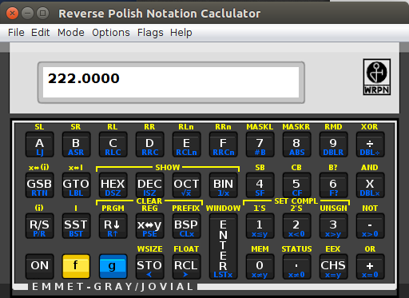
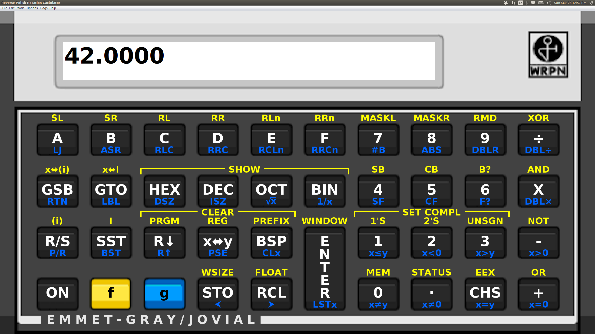

# WRPN, Desktop Java version

WRPN is [Emmet Gray's](http://www.emmet-gray.com/) wonderful little
calculator, modeled after the [HP 16-C](https://en.wikipedia.org/wiki/HP-16C).
The original is available at 
[http://www.wrpn.emmet-gray.com/](http://www.wrpn.emmet-gray.com/).
As of this writing, I've basically finished the Java/Desktop
version.  I'm quite happy with how it looks.
It uses fonts to draw the key labels, so they come out nice and 
crisp on big screens.  I call it done, and I have only tested it
on Linux and Windows so far.

In order to track the changes, I started with the original source, downloaded
on March 19, 2018 from
[https://en.wikipedia.org/wiki/HP-16C](https://en.wikipedia.org/wiki/HP-16C).
I applied a couple of little changes:

   *  I got rid of the Netbeans build, and imported the program into
      IntelliJ IDEA.

   *  I made all the files have Unix-style end-of-line and 8 space tabs.

Essentially, I did the minimum necessary to get the program to build and
run, with unix-style files (since the commit was from unix).

I don't have any predictions as to when I might work on this.  For now, I just
wanted to make a repository before I start tinkering.  It's nice to have a
couple of projects on the back burner :-)

Note that I'm also fiddling with the Android version of WRPN,
over in
[https://github.com/zathras/WRPN_Android](https://github.com/zathras/WRPN_Android).

Here's a huge screen grab, to show the UI scaled up:

